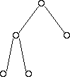
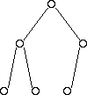
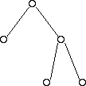
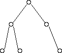
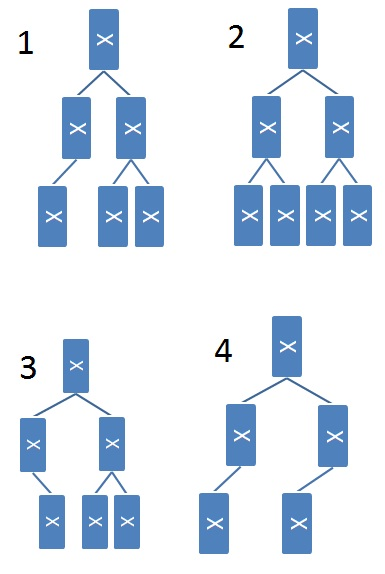
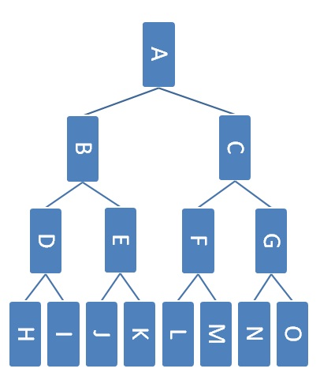

## Introduction

As usual, pull the files from the skeleton and make a new IntelliJ project.

We've learned about a few abstract data types already, including the stack and
queue. The stack is a last-in-first-out (LIFO) abstract data type where, much
like a physical stack, one can only access the top of the stack and must pop off
recently added elements to retrieve previously added elements. The queue is a
first-in-first-out (FIFO) abstract data type. When we process items in a queue,
we process the most recently added elements last.

But what if we want to model an emergency room, where people waiting with the
most pain are served first? We would need to serve patients regardless of when
they arrive, since those arriving first or most recently will not necessarily be
the ones most in pain.

Sometimes, processing items LIFO or FIFO is not what we want. We may instead
want to process items in order of *importance* or a *priority value*.  Enter the
priority queue...

The **priority queue** is an abstract data type that contains the following
methods:

- `insert(item, priority)`: inserts `item` into the priority queue with priority
  value `priority`
- `poll`: removes and returns the highest priority item in the priority queue
- `peek`: returns the highest priority item

It is similar to a `Queue` though the `insert` method will insert an item with
a corresponding "priority value" and the `poll` method in the priority queue
will remove the element with the highest priority, rather than the oldest
element in the queue.

## Exercise: PQ Implementations 

For the following exercises, we will think about the underlying implementations
for our priority queue. Discuss with your partner, and submit your answers to
the Gradescope assessment.

Note: for these exercises, each item will be associated with a priority value,
and we will prioritize items with the smallest priority value first.

### Exercise 1: Unordered Linked List

Considering the implementation of a priority queue with an **unordered linked
list** of $$N$$ elements, complete the following sentences:

> In the worst case, the run time to insert something into the priority queue is
> in...

- $$\Theta(1)$$
- $$\Theta(\log N)$$
- $$\Theta(N)$$
- $$\Theta(N \log N)$$
- $$\Theta(N^2)$$

> In the worst case, the run time to remove the element with highest priority is
> in...

- $$\Theta(1)$$
- $$\Theta(\log N)$$
- $$\Theta(N)$$
- $$\Theta(N \log N)$$
- $$\Theta(N^2)$$

### Exercise 2: Ordered Linked List

Considering the implementation of a priority queue with an **ordered linked
list** of $$N$$ elements, complete the following sentences:

> In the worst case, the run time to insert something into the priority queue is
> in...

- $$\Theta(1)$$
- $$\Theta(\log N)$$
- $$\Theta(N)$$
- $$\Theta(N \log N)$$
- $$\Theta(N^2)$$

> In the worst case, the run time to remove the element with highest priority is
> in...

- $$\Theta(1)$$
- $$\Theta(\log N)$$
- $$\Theta(N)$$
- $$\Theta(N \log N)$$
- $$\Theta(N^2)$$

### Exercise 3: Balanced Binary Search Tree

Considering the implementation of a priority queue with a **balanced binary
search tree** of $$N$$ elements, complete the following sentence:

> In the worst case, the run time to insert something into the priority queue is
> in...

- $$\Theta(1)$$
- $$\Theta(\log N)$$
- $$\Theta(N)$$
- $$\Theta(N \log N)$$
- $$\Theta(N^2)$$

> In the worst case, the run time to remove the element with highest priority is
> in...

- $$\Theta(1)$$
- $$\Theta(\log N)$$
- $$\Theta(N)$$
- $$\Theta(N \log N)$$
- $$\Theta(N^2)$$

But can we do better?

Java's priority queue is actually implemented with a data structure called a
**binary min heap**. For the remainder of this lab, we will study the heap data
structure and create our own implementation of a priority queue using a binary
min heap.

## Heaps

Having a fast implementation of a priority queue would be very helpful, but as
we saw in the last exercise, each of the implementations we tried has flaws.
Instead, let's take a closer look at the data structure Java uses to implement
it's priority queue.

The **heap** is a tree-like data structure that will help us implement a
priority queue with fast operations. In general, heaps will organize elements
such that the lowest or highest valued element will be easy to access. To use a
heap as the underlying implementation of a priority queue, we can use the
priority values that each of the priority queue's items are associated with as
the elements inside our heap. This way, the lowest or highest priority value
object will be at the top of the heap, and the `peek` operation will be very
fast.

There are two flavors of heaps: *min* heaps and *max* heaps. They're very
similar except that min heaps keep smaller elements towards the top of the heap,
and max heaps keep larger elements towards the top. Whichever heap (min or max)
that is used as the underlying structure of the priority queue will determine
what kind of values inside the heap will correspond to a higher priority. For
example, if one uses a min heap as the underlying representation of a priority
queue, then smaller priority values will be kept at the top of the heap. This
means that priority is given to objects with smaller priority values. This is
also how Java's `PriorityQueue` organizes its objects under the hood!

Let's now go into the properties of heaps.

### Heap Properties

Heaps are tree-like structures that follow two additional invariants. Elements
in a heap can have any number of children, but we will restrict our view to
binary heaps where each element will have only two children. Thus, binary heaps
are essentially binary trees with two extra invariants. However, it is important
to note that they are not binary *search* trees.

The invariants are listed below.

#### Invariant 1: Completeness

In order to keep our operations fast, we need to make sure the heap is well
balanced. We will define balance in a binary heap's underlying tree-like
structure as *completeness*.

A **complete tree** has all available positions for elements filled, except for
possibly the last row, which must be filled left-to-right. A heap must have it's
underlying tree structure complete.

Here are some examples of trees that are complete:

|  |  |

And here are some examples of trees that are **not** complete:

|  |  |

#### Invariant 2: Heap Property

We will also introduce another property that will allow us to organize the heap
in a way that will result in fast operations.

Every element must follow the **heap property**, which states that the value of
element $$E$$ must be smaller than those of all of its children or larger than
those of all of its children. The former is known as the *min-heap property*,
while the latter is known as the *max-heap property*.

If we have a min heap, this guarantees that the element with the lowest value
will always be at the root of the tree. If the elements are our priority values,
then we are guaranteed that the lowest priority valued element is at the root of
the tree. This helps us access that item quickly, which is what we need for a
priority queue!

For the rest of this lab, we will be discussing operations in terms of **binary
min heaps**. However, this logic can be applied to max heaps or heaps with any
number of children.

## Representation

In previous labs, we say that lists could be implemented using arrays or linked
nodes. Then, when we learned about disjoint sets, we also saw that they could be
both represented by linked nodes or arrays. It turns that this dual
representation extends to trees as well! Trees are generally implemented using
linked nodes, but they can also be represented using arrays.

Here's how we implement a binary tree using an array:

- The root of the tree will be in position 1 of the array (nothing is at
  position 0; this is to to make indexing more convenient).
- The left child of a node at position $$N$$ is at position $$2N$$. 
- The right child of a node at position $$N$$ is at position $$2N + 1$$. 
- The parent of a node at position $$N$$ is at position $$\frac{N}{2}$$.

Because binary heaps are essentially binary trees, we can use this array
representation to represent our binary heaps!

## Exercise: PQ Representation

In the `MinHeap.java` class that has been provided for you, implement the
binary tree representation discussed above by implementing the following 6
methods:

```java
private int getLeftOf(int index);
private int getRightOf(int index);
private int getParentOf(int index);
private void setLeft(int index, Node n);
private void setRight(int index, Node n);
private int min(int index1, int index2);
```

Our code will use an `ArrayList` instead of an array so we will not have to
resize our array manually, but the logic is the same.

## Discussion: `contains`

In our `MinHeap`, the node objects are contained in an `ArrayList` called
`contents`. Code for a hypothetical `contains` method is shown below.

```java
public boolean contains(E value) {
    for (E element : contents) {
        if (element != null && element.equals(value)) {
            return true;
        }
    }
    return false;
}
```

The `contains` method runs in time proportional to what in the worst case?
Discuss with your partner, and pick one of the following answers and submit to
the Gradescope assessment.

- $$h$$, the height of the tree
- $$n$$, the number of nodes in the tree
- $$l$$, the length of the array that contains the tree

## Heap Operations

For min heaps, there are three operations that we care about:
- `insert`: inserting an element to the heap
- `removeMin`: removing the item with the lowest value (this would correspond to
  removing the highest priority element in the corresponding priority queue)
- `peek`: getting the lowest value without removal (this would correspond to
  accessing the highest priority element in the corresponding priority queue)
  
When we do these operations, we need to make sure to maintain the above
invariants (completeness and the heap property). Let's walk through how to do
each one.

### `insert`

1. Put the item you're adding in the next available spot in the bottom row of
   the tree. If the row is full, make a new row. This is equivalent to placing
   the element in the next free spot in the array representation of the heap.
   This ensures the completeness of the heap because we're filling in the
   bottom-most row left to right.

2. If the element that has just been inserted is `N`, swap `N` with its parent
   as long as `N`'s value is smaller than its parent's value or until `N` is the
   new root. This is called **bubbling up**, and this ensures the min-heap
   property because once we finish bubbling up the element, all elements below
   it must be greater than it, and all elements above must be less than it.


### `removeMin`

1. Swap the element at the root with the element in the bottom rightmost
   position of the tree. Then, remove the right bottommost element of the tree
   (which should be the previous root and the minimum element of the heap). This
   ensures the completeness of the tree.

2. If the new root `N` is greater than either of its children, swap it with that
   child. If it is greater than both of its children, choose the smaller of the
   two children. Continue swapping `N` with its children until it is smaller
   than its children or it has no children. This is called **bubbling down**,
   and this ensures the min-heap property since we stop bubbling down only when
   the element `N` is less than both of its children and also greater than its
   parent.

### `peek`

The element with the smallest value will always be stored at the root due to the
min-heap property. Thus, we can just return the root node, without changing the
structure of the heap.

## Exercise: Heap Operations

Now, fill in the following missing methods in `MinHeap.java`:

```java
public E peek();
private void bubbleUp(int index);
private void bubbleDown(int index);
public void insert(E element);
public E removeMin();
public void update(E element);
```

When you implement `insert`, `removeMin`, and `update`, you should be using
`bubbleUp` and/or `bubbleDown`, and when you implement `bubbleUp` and
`bubbleDown`, you should be using `getLeft`, `getRight`, and `getParent`.

## Playing with Heaps

We just covered a lot of new concepts for heaps. To test yourself and see if you
understand them, try drawing a heap. Draw what happens when you insert numbers
into the heap and when you remove the smallest (or biggest, depending on if the
heap is a max or min heap) element. Discuss the results with your partner.

Also, take a look at
[this](http://www.cs.usfca.edu/~galles/JavascriptVisual/Heap.html) interactive
animation of a min heap. You can type in numbers to insert, or remove the min
element (ignore the `BuildHeap` button for now; we'll talk about that later this
lab) and see how the heap structure changes.

You can use this animation to check your own drawings too -- there is no
ambiguity when constructing heaps, so if you insert numbers in the same order,
yours should look exactly the same as this animation.

## Exercise: `HeapPQ`

Now let's use the `MinHeap` class that we created earlier to implement our own
priority queue!

Take a look at the code provided for `HeapPQ`, a class that implements the
`PriorityQueue` interface. Then, implement the methods of the interface
(duplicated below) of the `HeapPQ` class

```java
public T peek();
public void insert(T item, double priority);
public T poll();
public void changePriority(T item, double priority);
```

## Exercise: Heap Brainteasers

Now, let's get into some deeper questions about heaps.

For all the following questions, discuss with your partner and submit your
answer to the Gradescope assessment.

### Exercise 1: Heaps and BST's

Consider binary trees that are both max heaps and binary search trees.

How many nodes can such a tree have? Choose all that apply.

- 1 node
- 2 nodes
- 3 nodes
- 4 nodes
- 5 nodes
- Any number of nodes
- No trees exist

### Exercise 2: Determining Completeness 

It's not obvious how to verify that a linked binary tree is complete. A CS 61BL
student suggests the following recursive algorithm to determine if a tree is
complete:

1. A one-node tree is complete.

2. A tree with two or more nodes is complete if its left subtree is complete and
   has depth $$k$$ for some $$k$$, and its right subtree is complete and has
   depth $$k$$ or $$k - 1$$.

Here are some example trees. Think about whether or not the student's proposed
algorithm works correctly on them.



Choose all that apply to test your understanding of the proposed algorithm.

- Tree 1 is complete
- Tree 1 would be identified as complete
- Tree 2 is complete
- Tree 2 would be identified as complete
- Tree 3 is complete
- Tree 3 would be identified as complete
- Tree 4 is complete 
- Tree 4 would be identified as complete

### Discussion: Complete Trees and BFS

Another CS 61BL student claims that a binary tree is complete if all the leaves
in the tree come at the end of a breadth-first traversal of the tree. Discuss
with your partner to come up with counterexample to this claim.

### Exercise 3: The Third Biggest Element in a Max Heap

Here's an example max heap.



Which nodes could contain the third largest element in the heap **assuming that
the heap does not contain any duplicates**?

- Node A
- Node B
- Node C
- Node D
- Node E
- Node F
- Node G
- Node H
- Node I
- Node J
- Node K
- Node L
- Node M
- Node N
- Node O

Which nodes could contain the third largest element in the heap **assuming that
the heap can contain duplicates**?

- Node A
- Node B
- Node C
- Node D
- Node E
- Node F
- Node G
- Node H
- Node I
- Node J
- Node K
- Node L
- Node M
- Node N
- Node O

## Heapsort

Now, let's move onto an application of the heap data structure. Suppose you have
an array of $$N$$ numbers that you want to sort smallest-to-largest. One
algorithm for doing this is as follows:

1. Put all of the numbers in a min heap.
2. Repeatedly remove the min element from the heap, and store them in an array
   in that order.

This is called **heapsort**.

Now, what is the runtime of this sort? Since each insertion takes proportional
to $$\log N$$ comparisons once the heap gets large enough and each removal also
takes proportional to $$\log N$$ comparisons, the whole process takes
proportional to $$N \log N$$ comparisons.

It turns out we can actually make step 1 of heapsort run faster --- proportional
to $$N$$ comparisons --- using a process called *heapify*. (Unfortunately, we
can't make step 2 run any faster than $$N \log N$$, so the overall heapsort must
take $$N \log N$$ time.)

### Heapify

The algorithm for taking an arbitrary array and making it into a min (or max)
heap in time proportional to $$N$$ is called *heapify*. Pseudocode for this
algorithm is below:

    def heapify(array):
        index = N/2
        while index > 0:
            bubble down item at index
            index--

Conceptually, you can think of this as building a heap from the bottom up. To
get a visualization of this algorithm working, click on the `BuildHeap` button
on [the animation we linked
earlier](http://www.cs.usfca.edu/~galles/JavascriptVisual/Heap.html). This loads
a pre-set array and then runs heapify on it.

It is probably not immediately clear to you why this heapify runs in $$O(N)$$.
For those who are curious, you can check out an [explanation on
Wikipedia](http://en.wikipedia.org/wiki/Binary_heap#Building_a_heap) or section
9.3.4 of the DSA textbook.

## Conclusion

In today's lab, we learned about another abstract data type called the
**priority queue**. Priority queues can be implemented in many ways, but it is
often implemented with a binary min heap. It is very easy to conflate the
priority queue and the heap data structure, so make sure to understand the
difference between the two!

Additionally, we learned how to represent a heap with an array, as well as some
of its core operations. We then explored a few conceptual questions about heaps
and learned about a new sort that this new data structure provides, heapsort.

All in all, priority queues are an integral component of many algorithms for
graph processing (which we'll cover in a few labs). For example, the first few
weeks of CS 170, Efficient Algorithms and Intractable Problems, typically
involve graph algorithms that use priority queues.  Look out for priority queues
in other CS classes as well! You'll find them invaluable in the operating
systems class CS 162, where they're used to schedule which processes in a
computer to run at what times.

### Deliverables

To receive credit for this lab:
- Complete `MinHeap.java`
- Complete `HeapPQ.java`
- Submit the Gradescope assessment.
